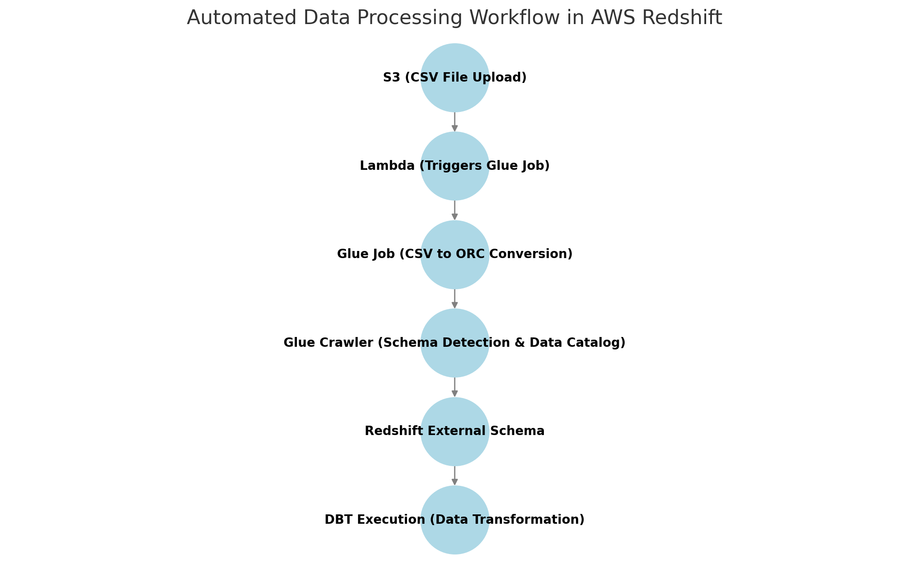

# Designing a Data Warehouse for Music Store Analytics

The Chinook Music Store is a digital platform that sells tracks, albums, and other media globally. Currently, its operational data is fragmented, making it challenging to derive insights into sales trends, customer behavior, product popularity, and employee performance. To address this, a centralized data warehouse will be designed and implemented, enabling advanced analytics and reporting.


## **Step 1: Define Business and Data Requirements**
### **Business Goals**
The data warehouse is being developed to address the following business needs:

1. **Sales Analytics**:  
   - Analyze daily, monthly, and yearly sales trends.  
   - Identify top-selling tracks, albums, and genres.  

2. **Customer Insights**:  
   - Segment customers based on purchase patterns, geography, and lifetime value.  
   - Analyze customer retention and identify engagement opportunities.  

3. **Employee Performance**:  
   - Evaluate employee contributions to sales.  
   - Identify top-performing employees and areas for improvement.  

### **Data Characteristics**
- The **data is already scraped and stored in an S3 bucket**.
- The primary data sources include:  
  - **Transactions Data**: Sales transactions with timestamps, product IDs, customer IDs, and employee IDs.  
  - **Customer Data**: Includes customer demographics, purchase history, and location.  
  - **Employee Data**: Employee roles, performance metrics, and contributions to sales.  
  - **Product and Genre Data**: Track, album, and genre information.  
- **Granularity**: Sales transactions recorded **daily**.  
- **Performance Requirements**: Queries must be **fast** for analytics.  
- **Storage Constraints**: The solution should be **optimized** for efficient storage while handling large-scale data.  

---

## **Step 2: Design the Data Warehouse Architecture**
### **Selecting AWS Redshift**
Given the performance and storage constraints, AWS Redshift is the preferred data warehouse solution due to:

- **Columnar Storage**: Optimized for analytical workloads, reducing disk I/O and improving query speed.  
- **Massively Parallel Processing (MPP)**: Enables fast query execution by distributing workloads across multiple nodes.  
- **Compression Techniques**: Helps reduce storage footprint and speeds up data retrieval.  
- **Seamless Integration with S3**: Facilitates fast data ingestion using `COPY` commands from Amazon S3.  
- **Scalability**: Can easily scale storage and compute capacity as data grows

# **Step 3: Data Modeling - Star Schema Design**

To support efficient analytics and ensure fast query performance, I designed a **Star Schema** for the data warehouse. The schema consists of:

- **Fact Tables**:
  - `fact_invoice`: Stores overall invoice details related to customer purchases.
  - `fact_invoice_line`: Stores detailed invoice line items for each purchased track.

- **Dimension Tables**:
  - `dim_album`
  - `dim_artist`
  - `dim_customer`
  - `dim_employee`
  - `dim_genre`
  - `dim_playlist`
  - `dim_media_type`
  - `dim_playlist_track`
  - `dim_track`

The following is the **Star Schema** design that I constructed:


## **Justification for Star Schema**
- **Optimized for Analytics**: The schema is structured to allow quick aggregations and trend analysis.
- **Faster Query Execution**: By using fact tables for transactional data and dimension tables for reference data, we reduce complex joins and improve query performance.
- **Scalability**: The design ensures easy scaling as new data and attributes are introduced.
- **Supports Business Insights**: The schema enables customer segmentation, sales trend analysis, and employee performance tracking.

Next, I will move on to **Step 4: ETL Process**, where I will extract data from S3, transform it, and load it into AWS Redshift.

# **Step 4: ETL Process - Extract, Transform, Load**

To ensure efficient data ingestion and transformation, I implemented an **ETL pipeline** using AWS services. This workflow automates data processing, optimizes storage, and improves query performance in Redshift.

## **4.1. Automated Data Processing Workflow**
The ETL process follows a structured pipeline:



### **4.2. Step-by-Step Workflow**
### **1. CSV File Upload (S3 Trigger)**
- Raw data is **uploaded as CSV files** into an Amazon S3 bucket.
- This triggers an **event notification**, which initiates the ETL process.

### **2. AWS Lambda Function Execution**
- An **AWS Lambda function** is triggered when a new file is detected in S3.
- It then **invokes an AWS Glue job**, ensuring real-time data processing.

### **3. AWS Glue Job**
- The Glue job performs **data transformation and optimization**, including:
  - **Converting CSV to ORC format** to enhance query performance and reduce storage costs.
  - **Tracking previously processed data** using Job Bookmarks to prevent duplicate ingestion.
  - **Parallel processing** for faster transformation of large datasets.

### **4. AWS Glue Crawler Execution**
- Once the Glue job completes, an **AWS Glue Crawler** is automatically triggered.
- It **scans the ORC files and updates the AWS Glue Data Catalog** with the latest schema.
- **Optimizations Achieved**:
  - **13% reduction in storage costs** due to ORC’s columnar storage efficiency.
  - **46% improvement in data processing time**, enabling faster ingestion into Redshift.
# **Step 5: Implementing the Data Warehouse in Redshift**

## **5.1. Creating the Bronze Schema**
The **Bronze layer** is the initial ingestion layer where raw data is stored **without any transformations**. This schema is created in **AWS Redshift Spectrum** and directly queries data from the **AWS Glue Data Catalog**.

```sql
CREATE EXTERNAL SCHEMA bronze
FROM DATA CATALOG
DATABASE "redshift-db"
IAM_ROLE 'arn:aws:iam::XXXXXXXXXXXX:role/service-role/AmazonRedshift-CommandsAccessRole-XXXXXXXX'
REGION 'eu-west-1';
```
## **5.2. Silver Layer - Processed & Standardized Data**
The Silver Layer is responsible for data standardization, cleaning, and transformation to ensure high-quality data for analytics.

### Processing in Silver Layer:-
* Data Type Handling: Standardized data types for consistency.
* Missing Values Treatment:
Imputed missing values for critical fields.
Removed records where missing data compromised integrity.
* Data Cleaning:
Removed duplicates to avoid incorrect aggregations.
Fixed inconsistencies in categorical data (e.g., standardizing country names).

### Incremental Data Processing
* Implemented materialized = incremental in DBT to process only new or updated records instead of full refreshes.
* Used incremental_strategy = delete+insert, ensuring:
New records are inserted.
Existing records are updated with the latest information

## **5.3. Gold Layer - Aggregated Analytical Data**
The Gold Layer is where data is aggregated and structured for final business intelligence reporting.

### Processing in Gold Layer
* Fact Table Creation:
Merged Invoice and InvoiceLine into a single fact table (fact_invoice).
Included business metrics like Quantity and Total Revenue.
Applied denormalization to optimize for analytical queries.

### Schema & Testing in Gold Layer
* Defined primary keys, foreign keys, and constraints in DBT YAML.
Ensured data integrity with tests for uniqueness, null constraints, and relationship checks.
