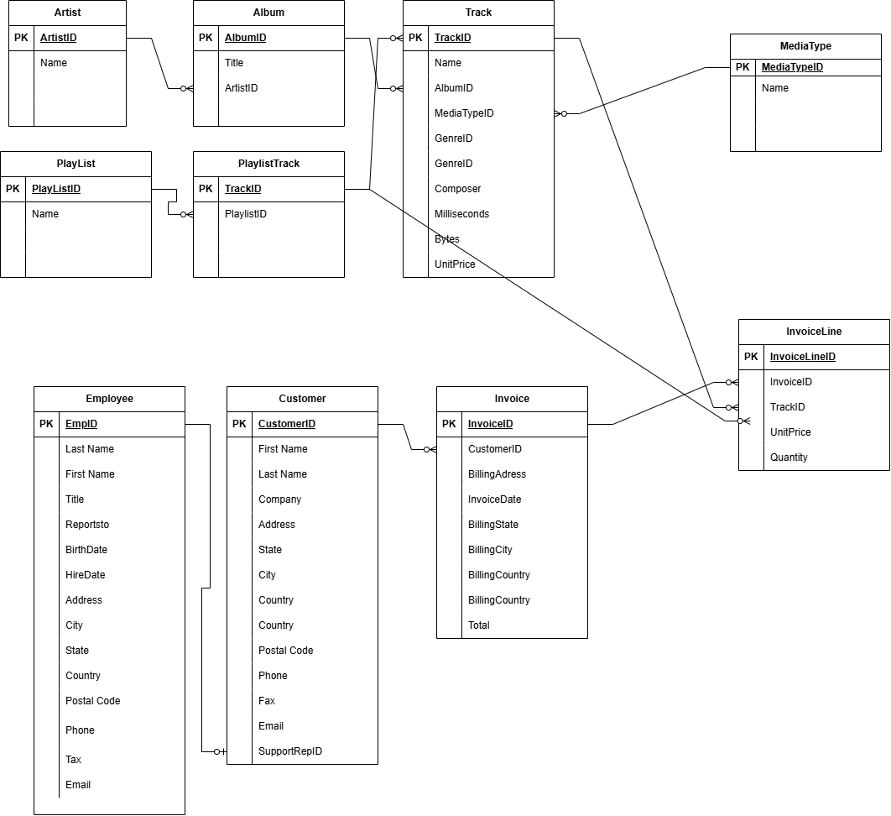

# Designing a Data Warehouse for Music Store Analytics

The Chinook Music Store is a digital platform that sells tracks, albums, and other media globally. Currently, its operational data is fragmented, making it challenging to derive insights into sales trends, customer behavior, product popularity, and employee performance. To address this, a centralized data warehouse will be designed and implemented, enabling advanced analytics and reporting.

## **Step 1: Define Business and Data Requirements**
### **Business Goals**
The data warehouse is being developed to address the following business needs:

1. **Sales Analytics**:  
   - Analyze daily, monthly, and yearly sales trends.  
   - Identify top-selling tracks, albums, and genres.  

2. **Customer Insights**:  
   - Segment customers based on purchase patterns, geography, and lifetime value.  
   - Analyze customer retention and identify engagement opportunities.  

3. **Employee Performance**:  
   - Evaluate employee contributions to sales.  
   - Identify top-performing employees and areas for improvement.  

### **Data Characteristics**
- The **data is already scraped and stored in an S3 bucket**.
- The primary data sources include:  
  - **Transactions Data**: Sales transactions with timestamps, product IDs, customer IDs, and employee IDs.  
  - **Customer Data**: Includes customer demographics, purchase history, and location.  
  - **Employee Data**: Employee roles, performance metrics, and contributions to sales.  
  - **Product and Genre Data**: Track, album, and genre information.  
- **Granularity**: Sales transactions recorded **daily**.  
- **Performance Requirements**: Queries must be **fast** for analytics.  
- **Storage Constraints**: The solution should be **optimized** for efficient storage while handling large-scale data.  

---

## **Step 2: Design the Data Warehouse Architecture**
### **Selecting AWS Redshift**
Given the performance and storage constraints, AWS Redshift is the preferred data warehouse solution due to:

- **Columnar Storage**: Optimized for analytical workloads, reducing disk I/O and improving query speed.  
- **Massively Parallel Processing (MPP)**: Enables fast query execution by distributing workloads across multiple nodes.  
- **Compression Techniques**: Helps reduce storage footprint and speeds up data retrieval.  
- **Seamless Integration with S3**: Facilitates fast data ingestion using `COPY` commands from Amazon S3.  
- **Scalability**: Can easily scale storage and compute capacity as data grows

# **Step 3: Data Modeling - Star Schema Design**

To support efficient analytics and ensure fast query performance, I designed a **Star Schema** for the data warehouse. The schema consists of:

- **Fact Tables**:
  - `fact_invoice`: Stores overall invoice details related to customer purchases.
  - `fact_invoice_line`: Stores detailed invoice line items for each purchased track.

- **Dimension Tables**:
  - `dim_album`
  - `dim_artist`
  - `dim_customer`
  - `dim_employee`
  - `dim_genre`
  - `dim_playlist`
  - `dim_media_type`
  - `dim_playlist_track`
  - `dim_track`

The following is the **Star Schema** design that I constructed:

## **Justification for Star Schema**
- **Optimized for Analytics**: The schema is structured to allow quick aggregations and trend analysis.
- **Faster Query Execution**: By using fact tables for transactional data and dimension tables for reference data, we reduce complex joins and improve query performance.
- **Scalability**: The design ensures easy scaling as new data and attributes are introduced.
- **Supports Business Insights**: The schema enables customer segmentation, sales trend analysis, and employee performance tracking.

Next, I will move on to **Step 4: ETL Process**, where I will extract data from S3, transform it, and load it into AWS Redshift.

